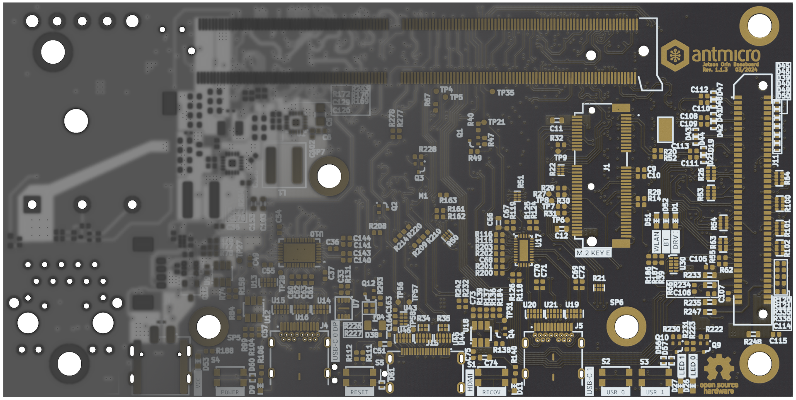

# gerber2blend

Copyright (c) 2022-2024 Antmicro



`gerber2blend` is an open-source utility dedicated to generating 3D models of Printed Circuit Boards (PCBs) in Blender (.blend) format.
The tool uses Gerber (Gerber RS-274X) input files that are used for producing physical PCBs. 
This makes the PCB visualization independent from the software used for designing it.
Currently `gerber2blend` supports Blender 3.2+.
Support for newer Blender versions will be added soon.

# Installation

## Requirements

`gerber2blend` depends on the following packages:

* gerbv
* expect
* inkscape >= 1.2

`gerber2blend` uses Blender 3.2 and its built-in Python3 interpreter, which are automatically installed during `gerber2blend` installation.
This requires two more dependencies used for downloading and unpacking Blender installation archive:

* wget
* xz-utils

## Installation (Debian)

1. Install the dependencies:

```bash
sudo apt install gerbv expect inkscape wget xz-utils
```

2. Configure PATH:

```bash
export PATH=$HOME/.local/bin:$PATH
```

3. Clone and install `gerber2blend`:

```bash
git clone https://github.com/antmicro/gerber2blend.git
cd gerber2blend
./scripts/install.sh
```

# Usage

Please check the [gerber2blend documentation](https://antmicro.github.io/gerber2blend/) for more usage guidelines.

To show available functionalities of `gerber2blend`, run:
```
gerber2blend --help
```

To open Blender with `gerber2blend`, run:
```
g2b_blender
```

For more information regarding Blender supported by the `gerber2blend` visit the [Blender 3.2 documentation](https://docs.blender.org/manual/en/3.2/).

## License

The `gerber2blend` utility is licensed under the Apache-2 [license](LICENSE).
